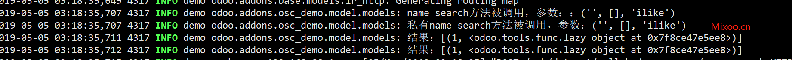

# 第一章 Odoo的内置方法

odoo为了方便开发，内置很多实用的方法，这些方法在官方文档中都没有说明，属于隐藏的知识，本章将带领大家来认识一下这些内置方法及其应用场景。

## name_get方法

首先要给大家介绍的就是name_get方法，这个方法在所有获取关联对象的名称时被调用，典型的场景就是Many2one字段的搜索框，当我们输入关键字后，下拉里列表中展示出来的名称就是通过name_get方法获取到的。

使用示例：
```python
@api.multi
def name_get(self):
    values = super(Demo, self).name_get()
    _logger.info(f"name_get方法返回的结果:{values}")
    return values
```


name_get方法的返回值是一个包含id和名称的元组组成的列表。

## name_search方法

提到了name_get方法，就不得不提name_search方法，因为我们在Many2one上进行模糊搜索时，搜索部分的工作是由name_search方法完成的，然后name_search把搜索到的结果传递给name_get方法，从而返回我们上面讲到的返回值列表。

name search方法接受4个参数：

* name: 被搜索的关键字
* args: 限定条件domain
* operator: 操作符，可选的参数有：=,!=,>,>=,<,<=,like,ilike,in,not in,child_of,parent_left,parent_right
* limit: 搜索结果的条数。



从结果上看，name_search方法并没有返回一个带文本的列表，而是一个延迟计算的函数，这是因为，在原生name_search方法中调用了lazy_name_get方法导致的，从这里也可以看出name_search和name_get方法的关系，即，由name_search方法限制条件过滤，然后再把结果传给name_get方法进行显示。

### 私有_name_search方法

其实在更底层的层面上，还有一个_name_search方法，与name_search方法不同的是_name_search方法接受额外的一个参数：name_get_uid，这个参数的作用是指定一个调用_search和lazy_name_get方法的用户ID，用来解决当前用户权限不足的问题。

比如当前我有一个模型osc.person，没有任何一个组有权限访问，正常访问会试如下的界面：


当我们给_name_search方法传一个uid=1进去的时候:

```python
@api.model
def _name_search(self, name, args=None, operator='ilike', limit=100, name_get_uid=None):
    _logger.info(f"私有name search方法被调用，参数：{name,args,operator}")
    res = super(Person, self)._name_search(name, args, operator, limit, 1)
    _logger.info(f"结果：{res}")
    return res
```


> odoo12中uid=1不再是超级用户的id，变成了机器人odoo_bot，超级管理员的ID变成了2

## fields_get_keys

获取本模型的所有字段。

## load_views

```python
@api.model
    def load_views(self, views, options=None):
        pass
```

load_views用于加载视图，接收两个参数views和options。

* views: list类型[view_id,view_type]
* options: 字典类型，options['toolbar']为真时加载上下文工具，options['load_filters']为真时返回模型的过滤器，options['action_id']为获取过滤器的动作ID

返回值为包含fields_views，fields和filters的字典。

load_views方法在每次浏览器加载视图时都会被调用，一般不需要重载，除非你对返回的视图有特殊的需求。


## fields_view_get

fields_view_get方法是用于获取视图的详细组成的方法。它跟load_views的关系是，load_view方法内部调用了本方法获取到详细的视图类型和视图布局。

fields_view_get方法的定义如下：

```python
@api.model
def fields_view_get(self, view_id=None, view_type='form', toolbar=False, submenu=False):
    pass
```

接收的参数如下：

* view_id： 视图的ID或None
* view_type: 视图的类型（form,tree, ...)
* toolbar: 是否包含上下文动作
* submenu: 该参数已过时弃用

比如我们之前的book_store应用，在加载视图的过程中，调用fields_view_get方法返回的结果示例如下:

```python
{'model': 'book_store.book', 'field_parent': False, 'arch': 
'<search string="图书搜索">\n <field name="author" can_create="true" can_write="true" modifiers="{&quot;required&quot;: true}"/>\n          <field name="date" modifiers="{}"/>\n          <field name="price" modifiers="{}"/>\n          <separator/>\n          <filter name="liu_book" string="大刘小说" domain="[(\'author\',\'=\',\'刘慈欣\')]"/>\n          <separator/>\n          <group expand="0" string="Group By">\n            <filter name="author" string="按作者分组" domain="[]" context="{\'group_by\':\'author\'}"/>\n          </group>\n        </search>', 
    'name': '图书搜索', 'type': 'search', 'view_id': 813, 'base_model': 'book_store.book', 
    'fields': {'author': {'type': 'many2one', 'change_default': False, 'company_dependent': False, 'context': {}, 'depends': (), 'domain': [], 'help': '作者', 'manual': False, 'readonly': False, 'relation': 'book_store.author', 'required': True, 'searchable': True, 'sortable': True, 'store': True, 'string': '作者', 'views': {}}, 
    'date': {'type': 'date', 'change_default': False, 'company_dependent': False, 'depends': (), 'help': '日期', 'manual': False, 'readonly': False, 'required': False, 'searchable': True, 'sortable': True, 'store': True, 'string': '出版日期', 'views': {}}, 
    'price': {'type': 'float', 'change_default': False, 'company_dependent': False, 'depends': (), 'group_operator': 'sum', 'help': '定价', 'manual': False, 'readonly': False, 'required': False, 'searchable': True, 'sortable': True, 'store': True, 'string': '定价', 'views': {}}}}
```

很容易看出，这个加载的是搜索的视图，同样的，form和tree视图加载时也会调用同样的方法。我们知道，odoo的页面布局都是写在XML中然后静态存储在数据库中的，而fields_view_get就给了我们一个动态修改视图的机会，我们可以根据自己需要在拿到视图数据之后进行修改，然后再返回给前端。

## fields_get

fields_get方法返回每个字段的定义

```python
@api.model
def fields_get(self, allfields=None, attributes=None):
    pass
```

它接收两个参数：

* allfields: 字段列表，如果为空则返回全部字段
* attributes： 每个字段的属性描述，如果为空则返回全部属性

前面我们知道，fields_view_get是被load_views调用的，同样的，fields_get也是被load_views调用的。他们一个返回视图的结构，一个返回字段的描述，最终形成一个完整的视图。我们可以看一下fields_get返回的结果示例：

```python
{'name': 
{'type': 'char', 'change_default': False, 'company_dependent': False, 'depends': (), 'help': '书名', 'manual': False, 'readonly': False, 'required': False, 'searchable': True, 'sortable': True, 'store': True, 'string': '名称', 'translate': False, 'trim': True}, 
'author': {'type': 'many2one', 'change_default': False, 'company_dependent': False, 'context': {}, 'depends': (), 'domain': [], 'help': '作者', 'manual': False, 'readonly': False, 'relation': 'book_store.author', 'required': True, 'searchable': True, 'sortable': True, 'store': True, 'string': '作者'}, 'date': {'type': 'date', 'change_default': False, 'company_dependent': False, 'depends': (), 'help': '日期', 'manual': False, 'readonly': False, 'required': False, 'searchable': True, 'sortable': True, 'store': True, 'string': '出版日期'}, 
'price': {'type': 'float', 'change_default': False, 'company_dependent': False, 'depends': (), 'group_operator': 'sum', 'help': '定价', 'manual': False, 'readonly': False, 'required': False, 'searchable': True, 'sortable': True, 'store': True, 'string': '定价'}, 'ref': {'type': 'reference', 'change_default': False, 'company_dependent': False, 'depends': (), 'manual': False, 'readonly': False, 'required': False, 'searchable': True, 'selection': [('book_store.author', '作者'), ('book_store.publisher', '出版商')], 'sortable': True, 'store': True, 'string': 'Ref'}, 'age': {'type': 'integer', 'change_default': False, 'company_dependent': False, 'depends': ('date',), 
'group_operator': 'sum', 'manual': False, 'readonly': True, 'required': False, 'searchable': True, 'sortable': False, 'store': False, 'string': '书龄'}, 'category': {'type': 'char', 'change_default': False, 'company_dependent': False, 
'depends': (), 'manual': False, 'readonly': False, 'required': False, 'searchable': True, 'sortable': True, 'store': True, 'string': '分类', 'translate': False, 'trim': True}, 'id': {'type': 'integer', 'change_default': False, 'company_dependent': False, 'depends': (), 'manual': False, 'readonly': True, 'required': False, 'searchable': True, 'sortable': True, 
'store': True, 'string': 'ID'}, 'display_name': {'type': 'char', 'change_default': False, 'company_dependent': False, 'depends': (), 'manual': False, 'readonly': True, 'required': False, 'searchable': False, 'sortable': False, 'store': False, 'string': 'Display Name', 'translate': False, 'trim': True}, 'create_uid': {'type': 'many2one', 'change_default': False, 'company_dependent': False, 'context': {}, 'depends': (), 'domain': [], 'manual': False, 'readonly': True, 'relation': 'res.users', 'required': False, 
'searchable': True, 'sortable': True, 'store': True, 'string': 'Created by'}, 
'create_date': {'type': 'datetime', 'change_default': False, 'company_dependent': False, 'depends': (), 'manual': False, 'readonly': True, 'required': False, 'searchable': True, 'sortable': True, 'store': True, 'string': 'Created on'}, 'write_uid': {'type': 'many2one', 'change_default': False, 'company_dependent': False, 'context': {}, 'depends': (), 'domain': [], 'manual': False, 'readonly': True, 'relation': 'res.users', 'required': False, 'searchable': True, 'sortable': True, 
'store': True, 'string': 'Last Updated by'}, 'write_date': {'type': 'datetime', 'change_default': False, 'company_dependent': False, 'depends': (), 'manual': False, 'readonly': True, 'required': False, 'searchable': True, 'sortable': True, 'store': True, 'string': 'Last Updated on'}, '__last_update': {'type': 'datetime', 'change_default': False, 'company_dependent': False, 'depends': ('create_date', 'write_date'), 'manual': False, 'readonly': True, 'required': False, 'searchable': False, 
'sortable': False, 'store': False, 'string': 'Last Modified on'}, 'publisher_id': {'type': 'many2one', 'change_default': False, 'company_dependent': False, 'context': {}, 
'depends': ('author.publisher_id',), 'domain': [], 'help': '', 'manual': False, 
'readonly': False, 'related': ('author', 'publisher_id'), 'relation': 'book_store.publisher', 
'required': True, 'searchable': True, 'sortable': True, 'store': False, 'string': '签约出版商'}}
```