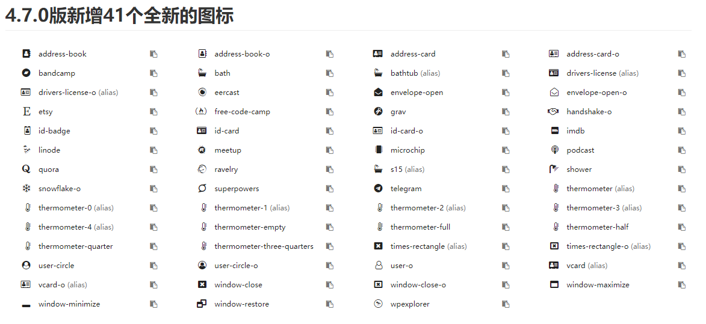
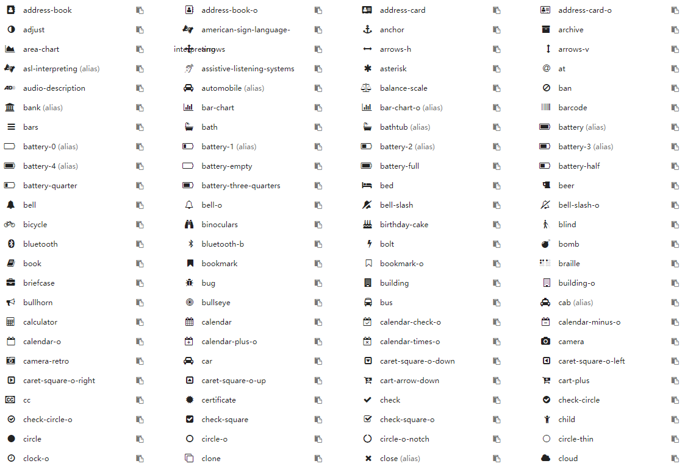
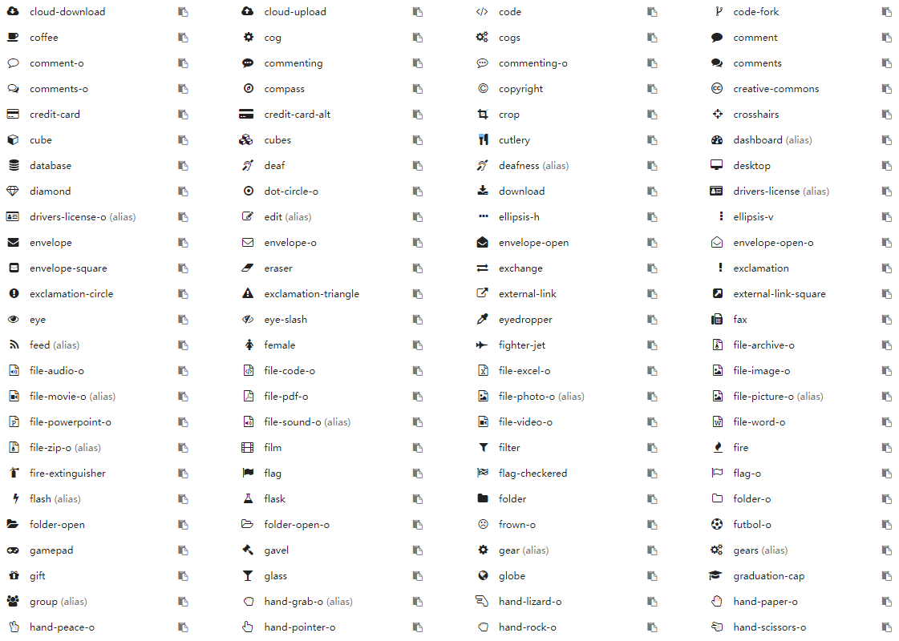
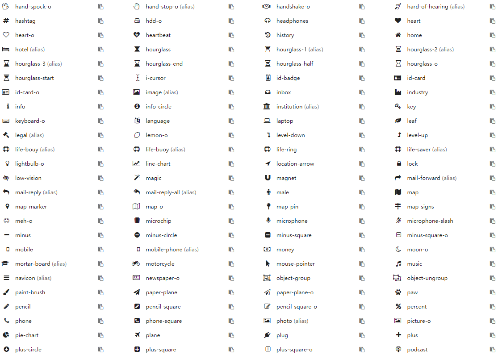
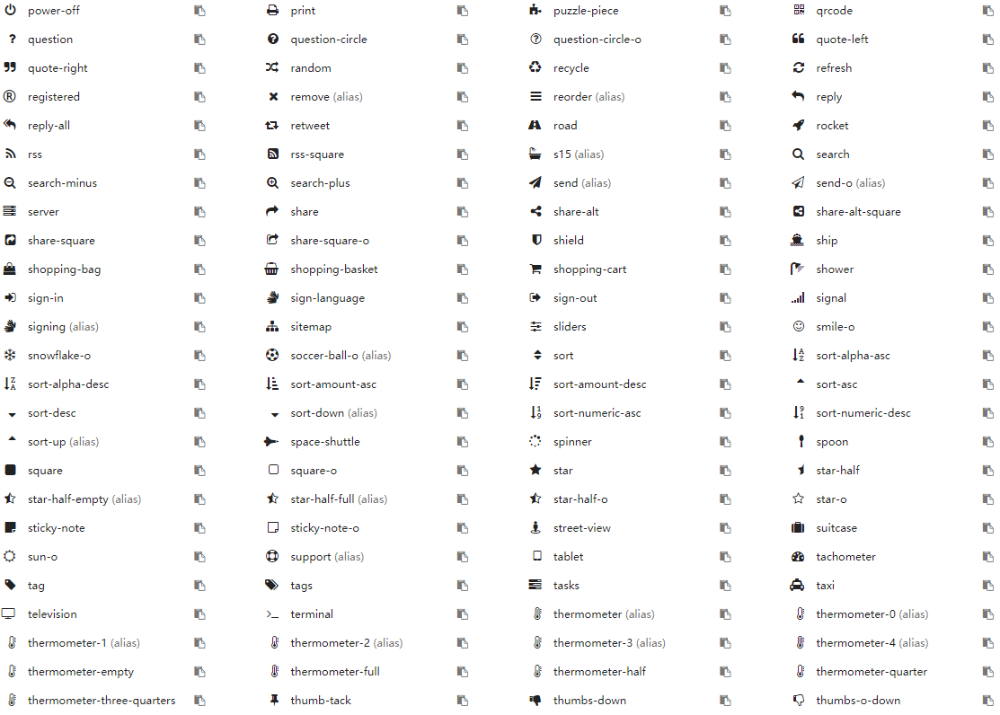

# 第六章 Odoo中的图标

不知道你有没有疑惑，odoo中的图标都是从哪里来的？

## Font Awesome

可能有搞过前端的同学听了解过这个字体库，它可以提供可缩放矢量图标，它可以被定制大小、颜色、阴影以及任何可以用CSS的样式。我们的odoo中的矢量图标都是基于Font Awesome库的。当前版本(12.0)使用的fontawesome库的版本是4.7.0。

odoo中的可用图标库可以在如下的位置找到包含图标css文件：

```sh
/addons/web/static/lib/fontawesome/css/font-awesome.css
```

## 图标库

虽然知道了css样式文件的位置，但是并没有一个可视化的工具可以供我们选择。大家可以到这个[网址](http://fontawesome.dashgame.com/)去查看图标列表。根据自己的喜好使用相应的图标。

方便起见，这里提供一个常见的图标库图片，仅供参考。







## 基本的使用

在css样式中使用前缀fa加上图标名称即可。

```html
<i class="fa fa-camera-retro"></i>
```

## 放大图标

使用fa-lg (33%递增)、fa-2x、 fa-3x、fa-4x，或者 fa-5x 类来放大图标。

```html
<i class="fa fa-camera-retro fa-lg"></i> fa-lg
<i class="fa fa-camera-retro fa-2x"></i> fa-2x
<i class="fa fa-camera-retro fa-3x"></i> fa-3x
<i class="fa fa-camera-retro fa-4x"></i> fa-4x
<i class="fa fa-camera-retro fa-5x"></i> fa-5x
```

## 动画

使用 fa-spin 类来使任意图标旋转，现在还可以使用 fa-pulse 来使其进行8方位旋转。

```html
<i class="fa fa-spinner fa-spin"></i>
<i class="fa fa-circle-o-notch fa-spin"></i>
<i class="fa fa-refresh fa-spin"></i>
<i class="fa fa-cog fa-spin"></i>
<i class="fa fa-spinner fa-pulse"></i>
```

## 旋转与翻转

使用 fa-rotate-* 和 fa-flip-* 类可以对图标进行任意旋转和翻转。

```html
<i class="fa fa-shield"></i> normal<br>
<i class="fa fa-shield fa-rotate-90"></i> fa-rotate-90<br>
<i class="fa fa-shield fa-rotate-180"></i> fa-rotate-180<br>
<i class="fa fa-shield fa-rotate-270"></i> fa-rotate-270<br>
<i class="fa fa-shield fa-flip-horizontal"></i> fa-flip-horizontal<br>
<i class="fa fa-shield fa-flip-vertical"></i> icon-flip-vertical
```

更多的使用方法，请参考Font-Awesome官方网站。

