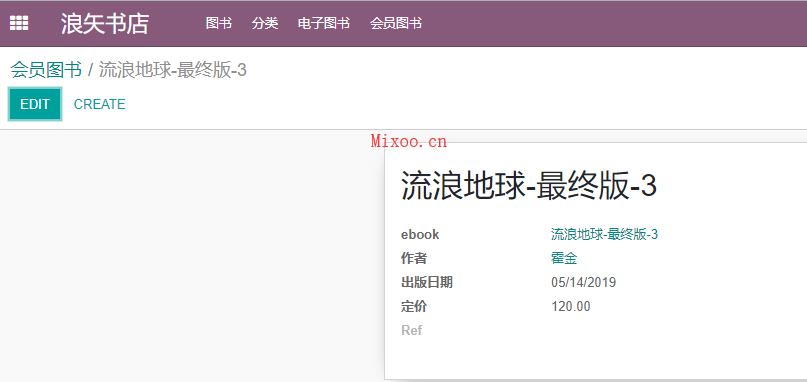
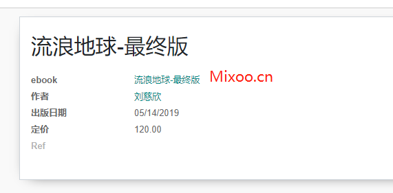
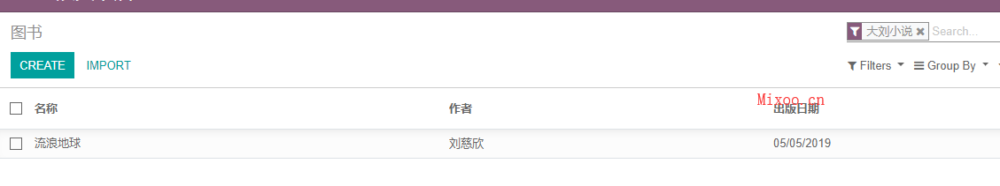
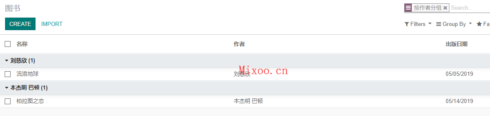
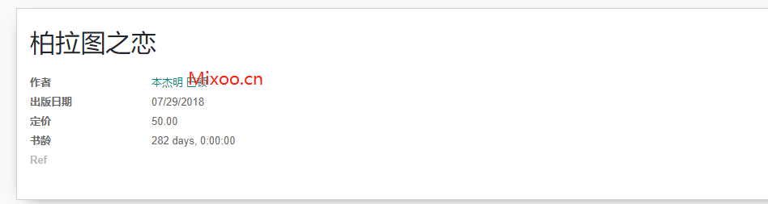

# 第四章 继承与搜索

odoo支持继承，可以方便地像python语言中的继承拓展既有的对象属性，这篇第一部分将介绍Odoo中的继承，搜索也是Odoo中常见的操作之一，第二部分将介绍Odoo中的搜索逻辑。

## 继承

这里我们还是沿用前面的书店模块，之前我们有了图书这个模型，现在我们希望书店能够上架一种新的图书-电子书，电子书区别于纸质书的特点就是无需纸张，但是需要规定电子书的格式，比如常见的epub,mobi,awz3等等，因此，我们需要在前边的图书模型上进行拓展，又不能影响既有图书的属性，怎么办，这就需要用到了继承，我们可以新建一个电子图书的模型，继承自图书，新增电子书属性。

### 继承的方式

odoo的继承不是像python的继承直接在class的括号中添加继承类，而是在类属性_inherit中添加，如上面的例子，代码就可以写成下面的样子：

```python
class eBook(models.Model):
    _inherit = "book_store.book"

    etype = fields.Selection(selection=[('mobi', 'Mobi'), ('epub', 'Epub'), (
        'awz', 'Awz3')], string='电子书格式', default='epub')
```

需要注意的是，上面的这种方式，在实际数据库中还是同一张表的扩展，也就是说，这种方式不能实现我们前面所说的效果。这种继承方式的使用场景是继承自odoo官方模块，为原有模块进行扩展而不修改源码，这样可以保持官方代码的干净，避免带来污染。如果想要使用另一张表，则需要给新模型起一个新的名字：

```python
class eBook(models.Model):
    _inherit = "book_store.book"
    _name = "book_store.ebook"

    etype = fields.Selection(selection=[('mobi', 'Mobi'), ('epub', 'Epub'), (
        'awz', 'Awz3')], string='电子书格式', default='epub', help='')
```

这样的数据库中就会多出一张表，包含所有的book_store_book表中的字段，并且还有ebook对象新增的字段：


两种方式各有优缺点，请读者根据实际情况灵活运用。

### 多继承

Odoo也支持多继承，方法是把_inherit的值变成一个要继承的列表：

```python
class sBook(models.Model):
    _inherit = ["book_store.book","book_store.ebook"]
    _name = "book_store.sbook"

    etype = fields.Selection(selection=[('mobi', 'Mobi'), ('epub', 'Epub'), (
        'awz', 'Awz3')], string='电子书格式', default='epub', help='')
```

继承的顺序从左到右

### 属性继承

Odoo还有另外的一种继承方式，不指明要继承的对象，而是指定本对象的某个Many2one的字段继承自一个其他对象，被继承的该对象的字段自动加载到本对象中，并且当其中任何一方的值发生变化时，都会同步到另一方中，这里把这种继承方式命名为属性继承。说的比较抽象，接下来我们举个栗子：

新建对象会员图书(sbook)，但是此对象不继承任何一个对象，只是在属性中添加一个对电子图书(ebook)的Many2one关联字段，并在_inherits属性中声明这个字段：

```python
class sBook(models.Model):
    
    _name = "book_store.sbook"
    _inherits = {'book_store.ebook': 'ebook_id'}

    ebook_id = fields.Many2one(
        'book_store.ebook', string='ebook', ondelete='restrict', required=True, help='')
```

_inherits属性是个字典，key为Many2one字段中外关联的对象名，value为Many2one的字段名。然后我们为sBook对象编写一个视图：

```xml
<record model="ir.ui.view" id="book_store.slist">
      <field name="name">会员图书列表</field>
      <field name="model">book_store.sbook</field>
      <field name="arch" type="xml">
        <tree>
          <field name="name"/>
          <field name="author"/>
          <field name="date"/>
          <field name="price"/>
        </tree>
      </field>
    </record>

    <record id="book_store.sbook_form" model="ir.ui.view">
      <field name="name">会员图书</field>
      <field name="model">book_store.sbook</field>
      <field name="arch" type="xml">
        <form string="图书详情" class="">
          <sheet>
            <h1>
              <field name="name" invisible="0"/>
            </h1>
            <group>
              <field name="ebook_id"/>
              <field name="author" invisible="0"/>
              <field name="date" invisible="0"/>
              <field name="price" invisible="0"/>
              <field name="ref" invisible="0"/>
            </group>
          </sheet>
        </form>
      </field>
    </record>

    <record model="ir.actions.act_window" id="book_store.saction_window">
      <field name="name">会员图书</field>
      <field name="res_model">book_store.sbook</field>
      <field name="view_mode">tree,form</field>
    </record>
```

然后升级模块，可以看到如下图：



好像没有什么特别之处。。。别急，我们来修改一下会员图书的名字，将其改为"流浪地球-最终版"，并把作者改回"刘慈欣":



发现了没有，ebook属性的名字，随着我们会员图书的名字的改名而改名，并且ebook的作者字段也变成了我们所选的"刘慈欣"。

这就是Odoo中比较著名的模板继承方式，典型的应用就是官方模块中的产品模板和产品的关系，在Odoo原生模块中，有一个对象叫做product.template，顾名思义就是产品模板，指的是一系列产品的通用模板属性。而在销售、采购和仓储的实际运用中，使用的是叫product.product的对象，这个才是真正的产品。product.product和product.template的关系就是我们上面所说的属性继承的关系，product.pruduct中一个many2one的字段product_tmpl_id关联的就是product.template，当product.template中的属性发生变化时，没有被重写（注意，product.product对象中有些字段覆盖了product.template中的字段）的属性就会跟着变化，形成了一种有趣的引用关系。关于这点，读者可以到产品中修改一下属性进行体会。

## 搜索

Odoo中最常用的搜索就是位于Form页面右上角的搜索框了，搜索框的逻辑包括过滤、分组，基本的操作可以通过XML文件配置出来，有些比较高级的搜索需要通过代码的方式实现。

### 基本搜索

默认情况下，搜索框只有一个搜索对象的name字段的功能：


如果想要搜索其他字段，就需要在filter中自行选择要搜索的字段和需要的操作符，进行过滤搜索：


可供选择的操作符包括如下几种：

* 包含
* 不包含
* 等于
* 不等于
* 已设置
* 未设置

这样基本可以满足用户的需求。

> 这里可选字段包括了本对象中所有可存储的字段，也就是在数据库中可搜索的字段，对于compute类型的字段来说，不可以搜索，也就不会出现在备选字段中。

用户可以点击favorites进行收藏，将当前的筛选条件进行保存，以供下次搜索使用。

### 自定义搜索

基本搜索满足了用户的基本搜索需求，但是不够简洁快速，如果想要更快捷的方式，就需要自定义搜索条件了。自定义搜索条件，基本可以通过配置XML文件实现，下面就详细介绍一下这几种搜索方式。

#### Filter

顾名思义，Filter就是过滤，具体的定义规则就是在XML文件中定义一个search视图：

```xml
<record id="book_store_search_view" model="ir.ui.view">
      <field name="name">图书搜索</field>
      <field name="model">book_store.book</field>
      <field name="arch" type="xml">
        <search string="图书搜索">
          <field name="author"/>
          <field name="date"/>
          <field name="price"/>
          <separator/>
          <filter name="liu_book" string="大刘小说" domain="[('author','=','刘慈欣')]" />
          <separator/>
          <group expand="0" string="Group By">
            <filter name="author" string="按作者分组" domain="[]" context="{'group_by':'author'}"/>
          </group>
        </search>
      </field>
    </record>
```

search结点中的三种标签：

* field: 按字段搜索，即你输入值以后，下拉进行筛选：
  

* filter: 按照预定的domain进行过滤：
  

* group: 根据字段进行分组：
  
  分组的做法是在context属性的中传入'group_by'的字段值。


### 计算字段的搜索

在Odoo中还有一类字段，是不存储在数据库中的，而是通过计算的方式在需要显示的时候计算出来的值。这类字段通常会使用compute属性，compute对应的是一个方法，这个方法在字段被显示和调用时调用。

沿用以前的模块，我们给book模型添加一个书龄的属性，该属性是由计算出来的：

```python
age = fields.Integer('书龄', compute="_get_book_age", search="_search_ages")

@api.depends('date')
def _get_book_age(self):
    self.age = (datetime.now().date() - self.date).days
```

在form页面中会显示出该书的书龄：



你在filter工具中是看不到该字段的，那么我们如何对书龄进行搜索呢？

这里需要用到我们前面说过的一个字段的一个属性，search，search是用来重载字段被搜索时的方法的。搜索书龄，我们可以这么写：

```python
@api.model
def _search_ages(self, operator, operand):
    """search方法"""
    if operator not in ('>', '>=', '<', '<=', '='):
        return []
    if type(operand) not in (float, int):
        return []
    start_date = datetime.now().date() - timedelta(days=operand)
    ops = {
        ">": "<",
        ">=": "<=",
        "<": ">",
        "<=": ">=",
        "=": "="
    }
    return [('date', ops[operator], start_date)]
```

search方法接收两个参数，一个操作符，一个是操作数，操作符根据字段的类型不同而不同，我们这里是integer类型，所对应的操作符就是大于小于和等于等操作符。search方法的返回值是一个domain对象，也就是有元组组成的列表。odoo会根据domain对记录进行过滤，并显示结果，最后的效果图如下：

。