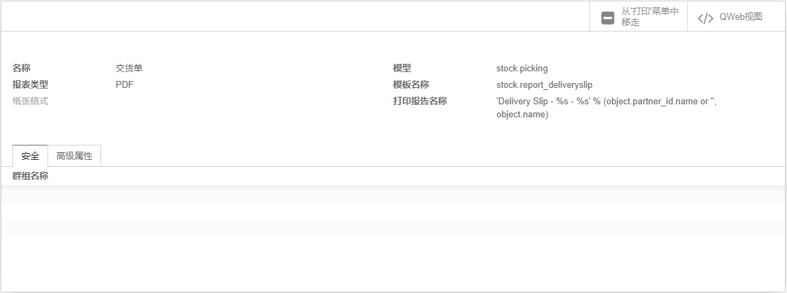

# 第十一章 报表

## 报表引擎

odoo的报表引擎使用的是QWeb，关于QWeb的的更多内容，会在第二部分中有单独的篇章介绍，目前只需要知道，QWeb是odoo自己开发的一套模板渲染引擎即可。

## 创建报表

## 修改报表

对于我们需要修改的报表，可以在设置中-动作-报表中根据模型找到对应的模板文件。

由上图中的按钮Qweb视图可以找到对应的Qweb代码文件，我们可以通过修改Qweb代码的方式来修改报表。