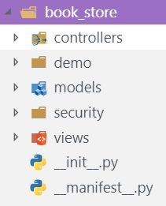
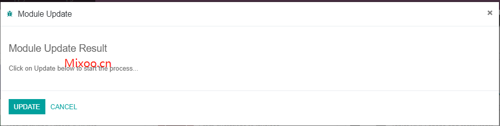
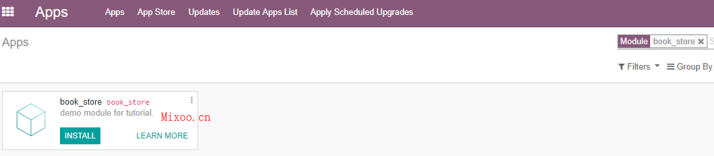
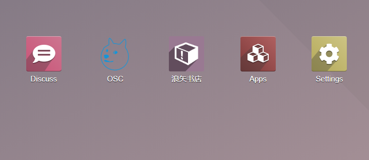
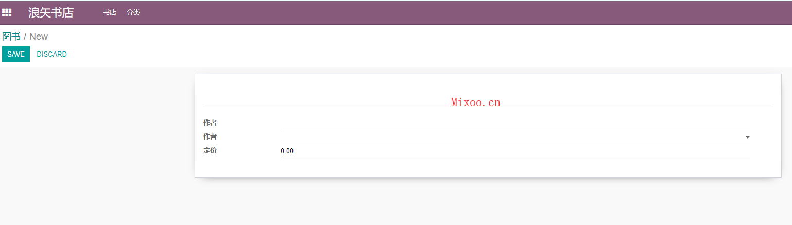
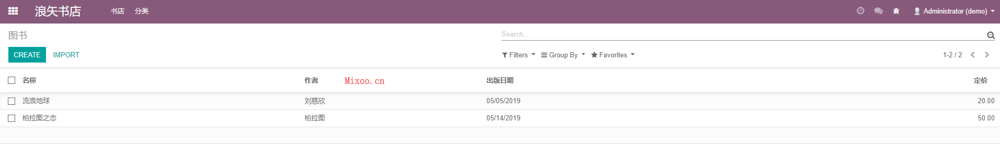

# 第二章 第一个模块

本系列教程将告诉大家如何做一个书店，所以我们将给这个模块命名为book_store。模块的命名一定要体现出模块的用途，且不要跟已有的模块名重名，所以在模块前加上公司名是一个不错的选择。

## 脚手架

下面的命令可以帮助我们创建一个标准模块所需要的全部文件：

```sh
odoo scaffold book_store .
```

这个命令是odoo提供的脚手架，scaffold是命令，后面跟模块名和模块路径，执行完命令的结果如下：



然后我们再根据我们的实际情况对其中的某些文件进行修改就可以了。

## odoo模块结构

* controllers文件夹主要是一些HTTP请求相关的业务逻辑。
* models是模型文件夹，业务的模型都放在这里。
* security 权限相关的文件。
* views 视图文件夹，关于界面布局的逻辑在这里。
* \__init_\_ 熟悉python的都懂，不说了
* \__manifest_\_ 9.0之前叫_\_openerp_\_.py，Odoo模块必须的文件，包含必要的模块信息。

接下来我们修改一下模块的信息，修改_\_manifest_\_.py文件，如以下：

```python
# -*- coding: utf-8 -*-
{
    'name': "book_store",

    'summary': """
        demo module for tutorial.""",

    'description': """
        This module is writing for who wants learn odoo developments.
    """,

    'author': "KevinKong",
    'website': "http://mixoo.cn",

    # Categories can be used to filter modules in modules listing
    # Check https://github.com/odoo/odoo/blob/12.0/odoo/addons/base/data/ir_module_category_data.xml
    # for the full list
    'category': 'tutorial',
    'version': '0.1',

    # any module necessary for this one to work correctly
    'depends': ['base'],

    # always loaded
    'data': [
        'security/ir.model.access.csv',
        'views/views.xml',
        # 'views/templates.xml',
    ],
    # only loaded in demonstration mode
    'demo': [
        'demo/demo.xml',
    ],
    "application": True
}
```

关于这个字典里的属性，注释中大多都解释了。写完这个，我们可以验证一下Odoo是否能够正确加载我们的模块。

> 模块的路径需要写到配置文件中，如果是笔者这种安装方式，配置文件在/etc/odoo/odoo.conf

启动odoo后，打开debug模式(URL/web?debug)，在应用-更新本地模块中点击更新：



然后再搜素book_store:



这样就说明odoo正确的加载了我们的模块。

## 第一个模块

模型对应的是数据库中的数据表，但是模型的概念比表跟多，很多属性不存储在数据库中。

我们新建一个书的模型，首先，书有多种属性，这里我们先写如下几种：

* 名称
* 作者
* 日期
* 定价

名称是Char类型，作者这里先设置为Char类型，日期是Datetime，定价就是Float。

```python
class Book(models.Model):
    _name = 'book_store.book'

    name = fields.Char('名称', help='书名')
    author = fields.Char('作者', help='作者')
    date = fields.Datetime("出版日期", help="日期")
    price = fields.Float("定价", help="定价")
```

然后我们需要给这个模型设置一个界面，编辑views文件夹下的view.xml文件，添加如下代码：

```xml
<odoo>
  <data>
    <!-- explicit list view definition -->

    <record model="ir.ui.view" id="book_store.list">
      <field name="name">图书列表</field>
      <field name="model">book_store.book</field>
      <field name="arch" type="xml">
        <tree>
          <field name="name"/>
          <field name="author"/>
          <field name="date"/>
          <field name="price"/>
        </tree>
      </field>
    </record>

    <record id="book_store.book_form" model="ir.ui.view">
      <field name="name">图书</field>
      <field name="model">book_store.book</field>
      <field name="arch" type="xml">
        <form string="图书详情" class="">
          <sheet>
            <h1>
              <field name="name" invisible="0"/>
            </h1>
            <group>
              <field name="author" invisible="0"/>
              <field name="date" invisible="0"/>
              <field name="price" invisible="0"/>
            </group>
          </sheet>
        </form>
      </field>
    </record>


    <!-- actions opening views on models -->
    
    <record model="ir.actions.act_window" id="book_store.action_window">
      <field name="name">图书</field>
      <field name="res_model">book_store.book</field>
      <field name="view_mode">tree,form</field>
    </record>
   

    <!-- server action to the one above -->
    <!--
    <record model="ir.actions.server" id="book_store.action_server">
      <field name="name">book_store server</field>
      <field name="model_id" ref="model_book_store_book_store"/>
      <field name="state">code</field>
      <field name="code">
        action = {
          "type": "ir.actions.act_window",
          "view_mode": "tree,form",
          "res_model": self._name,
        }
      </field>
    </record>
    -->

    <!-- Top menu item -->

    <menuitem name="浪矢书店" id="book_store.menu_root"/>

    <!-- menu categories -->

    <menuitem name="书店" id="book_store.menu_book" action="book_store.action_window" parent="book_store.menu_root"/>
    <menuitem name="分类" id="book_store.menu_category"  parent="book_store.menu_root"/>

    <!-- actions -->
    <!--
    <menuitem name="List" id="book_store.menu_1_list" parent="book_store.menu_1" action="book_store.action_window"/>
    <menuitem name="Server to list" id="book_store" parent="book_store.menu_2" action="book_store.action_server"/>
    -->
  </data>
</odoo>
```

XML文件写完以后，在应用-模块中点击升级模块对模块进行升级。

> 当修改了py文件时，需要重启odoo进程，而修改了xml等静态文件则需要升级模块。

升级完成后，进入odoo发现没有我们写完的menu。这是因为，我们只创建了model却没有给任何一个组赋予访问这个模型的权限，因此我们无权查看这个模块的界面。

给book模型添加权限，编辑security文件夹中的ir.model.access.csv文件，csv文件从左右到依次是，id，名称，模型id，组ID，读权限，写权限，创建权限、删除权限。

其中模型是model_加上模型名组成的，其中的点号要换成下划线。

```csv
id,name,model_id:id,group_id:id,perm_read,perm_write,perm_create,perm_unlink
access_book_store_book,book_store.book,model_book_store_book_store,base.group_user,1,1,1,1
```

然后我们重新升级模块。

就可以看见我们自定义的菜单出来了：



点击菜单我们可以创建图书：



和查看图书列表：



这样我们的第一个模块就完成了。

## 开发者调试模式

正常情况下，代码文件发生改变需要重启odoo进程或升级模块，对开发者来说，频发的Ctrl+C和upgrade有时候比较费事，Odoo提供了一种免重启的模式，当代码文件发生变化时自动重载并更新视图文件，大大简化了开发的步骤。

启动这个模式的命令是在启动odoo的命令后添加一个–dev参数:

```python
odoo -c /etc/odoo/odoo.conf --dev=all
```

注意：可能会碰到下面的错误：

```python
'inotify' module not installed. Code autoreload feature is disabled
```

这是因为缺少依赖库inotify, 使用pip命令安装即可：

```python
pip install inotify
```

[本教程示例代码](https://github.com/block-cat/book_store/tree/master/models)