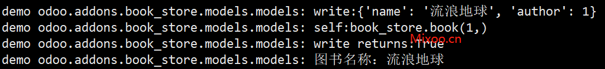
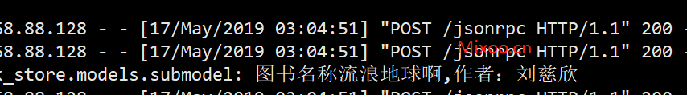
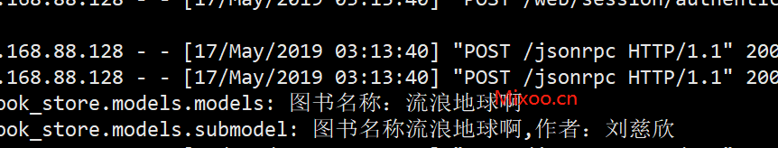
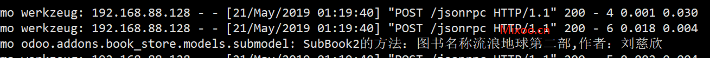
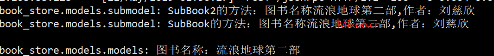

# 第六章 重载

## 重载的概念

开发的过程中，我们很有可能会碰到这样的场景，需要修改官方定义的某个模块中的某个方法。虽然我们可以直接修改源码达到目的，但那样会污染官方源码，不方便于维护和移植。

重载的概念就是通过继承，重写原有模块的某些方法，拦截原有的执行路径，达到修改或是改造的目的。

## 简单的重载

接下来，我们先看一下，如何对一个既有模块的方法进行重载的操作，还是以我们的book_store模块为例，我们先给book_store.book对象添加要给新的类方法：log_book_name

```python
@api.one
def log_book_name(self):
    _logger.info(f"图书名称：{self.name}")
```

非常简单，就是打印一下本书的名字，然后为了方便测试，我们在使用odoorpc远程调用一下这个方法：

```python
odoo = odoorpc.ODOO(host=host, port=port)
odoo.login(db, user, password)

# 调用log_book_name方法

book_obj = odoo.env['book_store.book']
book = book_obj.browse(1)

book.log_book_name()
```
运行测试，可以看到，当我们修改book的内容时，后台日志会输出本图书的名字。



### 重载

现在，我们希望能够把作者的名字也添加到日志中，但是不修改Book类的代码。这时候我们需要新建一个类，继承自Book(这里为了好区别，新建要给代码文件，名为SubModel.py):

```python
class SubBook(models.Model):

    _inherit = "book_store.book"

    @api.one
    def log_book_name(self):
        """重载父类方法"""
        _logger.info(f"图书名称{self.name},作者：{self.author.name}")
```
重启升级模块儿后，通过rpc调用log_book_name方法可以看到，输出的日志已经带有作者信息了：




### 复用父类调用的结果

如果希望在父类方法返回的结果上进行修改，可以通过super方法进行调用，这个例子中由于父类方法并不返回值，因此只是调用了一下父类，并没有真正的复用：

```python
@api.one
def log_book_name(self):
    """重载父类方法"""
    res = super(SubBook,self).log_book_name()
    _logger.info(f"图书名称{self.name},作者：{self.author.name}")
```

可以看到，父类方法也被调用：



### 私有方法不会被重载

有个例外，就是如果你的方法是私有方法(双下划线开头)，那么重载将不会起作用。 

```python
class Book(models.Model):
    ...
    @api.one
    def log_book_name(self):
        self.__log_book_name()

    def __log_book_name(self):
        print('Book私有方法')
        _logger.info(f"图书名称：{self.name}")

class SubBook(models.Model):
    ...
    def __log_book_name(self):
        print('SubBook私有方法')
        _logger.info(f"图书名称{self.name},作者：{self.author.name}")
```

将只有Book的方法会被调用，这点跟Python本身的继承表现是一致的。

## 多层重载

细心的朋友可能会有疑惑，如果多个子类都重载了父类的方法，那么会执行哪一个呢？下面我们就来揭晓这个问题的答案。

上面我们创建的一个子类SubBook，这里我们再次创建一个子类SubBook2，方法跟SubBook类似：

```python

class SubBook2(models.Model):

    _inherit = "book_store.book"

    @api.one
    def log_book_name(self):
        """重载父类方法"""
        # res = super(SubBook,self).log_book_name()
        _logger.info(f"SubBook2的方法：图书名称{self.name},作者：{self.author.name}")
```

运行rpc脚本，输出结果如下：



由此可以看出，当有多个子类重载了同一个父类方法时，只有最后加载的那个子模块的方法会被调用。

## 指定重载

如果，在子类SubBook中调用了父类的方法，同时子类SubBoo2也调用父类方法，那么会出现什么结果呢？

```python
class SubBook(models.Model):

    _inherit = "book_store.book"

    @api.one
    def log_book_name(self):
        """重载父类方法"""
        # res = super(SubBook,self).log_book_name()
        _logger.info(f"SubBook的方法：图书名称{self.name},作者：{self.author.name}")
        super(SubBook,self).log_book_name()

class SubBook2(models.Model):

    _inherit = "book_store.book"

    @api.one
    def log_book_name(self):
        """重载父类方法"""
        # res = super(SubBook,self).log_book_name()
        _logger.info(f"SubBook2的方法：图书名称{self.name},作者：{self.author.name}")
        super(SubBook2,self).log_book_name()
```

输出：



可以看到，三个方法都被调用了。因此，在子类中使用Super调用父类方法，会调用继承链上所有的重载方法。

那么，我们如何只通过子类SubBook2调用父类方法，而不触发SubBook中的同名方法呢?

答案是SubBook2中直接条用SubBook的父类方法：

```python
super(SubBook,self).log_book_name()
```
